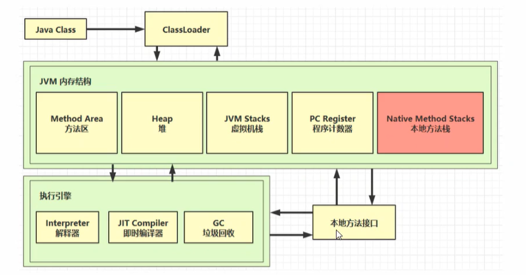
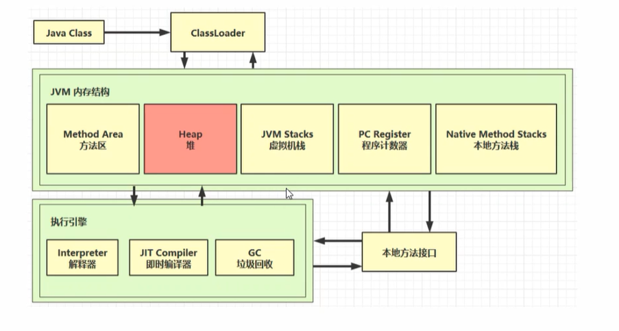

## 程序计数器

程序计数器的特点：线程私有，不会出现OOM（在Java虚拟机规范中是唯一一个不会出现内存溢出的区域）

## Java虚拟机栈（JAVA Virtual Machine Stacks）

定义：

* 每个线程运行时所需要的内存，称为虚拟机栈
* 每个栈由多个栈帧（Frame）组成，对应着每次方法调用时所占用的内存
* 每个线程只能有一个**活动栈帧**，对应着当前正在执行的那个方法

栈帧：每个方法运行时需要的内存（参数，局部变量表，返回地址，动态链接）

问题辨析

1. 垃圾回收是否涉及栈内存？

   不会，因为栈调用之后就自动弹出栈帧，根本不需要垃圾回收

2. 栈内存分配越大越好么？

   不是，栈内存可以通过-Xss调节，栈内存越大，那么线程数就越少，因为总的内存一定，每个线程的栈越大那么线程数就越少

3. 方法内的局部变量是否线程安全

   局部变量不存在线程安全性问题

### 栈内存溢出

栈内存溢出的原因有两个：

* 栈帧过多（方法递归调用过多）

  ```java
  public class StackOverFlowDemo {
      private static int count;
      public static void main(String[] args) {
          try {
              method1();
          } catch (Throwable t) {
              t.printStackTrace();
              System.out.println(count);
          }
      }
      private static void method1() {
          count++;
          method1();
      }
  }
  // 这样一份代码如果不加VM参数，那么会20000多次调用栈，最终出现StackOverFlowError
  // 如果加上-Xss 256k 调用了4000多次
  ```

* 栈帧过大导致栈内存溢出（不太容易出现）

  如果一个栈帧的大小直接超过了栈内存的大小，那么就会导致栈内存溢出StackOverFlowError,不过这种情况一般不会出现。
  
  

## 本地方法栈

同虚拟机栈，只不过本地方法栈是对本地方法的内存模型，java虚拟机栈是对java方法的内存模型




## 堆（GC堆）



### 堆的特点

* 线程共享，堆中的对象都需要考虑线程安全的问题

* 有垃圾回收机制

  ```java
  // -Xmx8m -Xmx参数可以控制堆空间的大小
  // 以下代码可能引起堆内存溢出 OutOfMemory 
  public class OutOfMemoryErrorDemo {
  
      public static void main(String[] args) {
          int i = 0;
          try {
              List<String> list = new ArrayList<>();
              String a = "hello";
              while (true) {
                  list.add(a);
                  a = a + a;
                  i++;
              }
          } catch (Throwable e) {
              e.printStackTrace();
              System.out.println(i);
          }
      }
  }
// 这段程序会报 java.lang.OutOfMemoryError: Java heap space 异常
  ```

  ### 堆内存诊断

  * jps工具

    查看当前系统中有哪些java进程

  * jmap工具

    查看堆内存暂用情况jmap -heap 进程id

  * jconsole工具
  
    图形界面的，多功能的检测工具，可以连续检测
  
  ```java
  package cn.ljtnono.demo;
  
  public class JconsoleDemo {
      public static void main(String[] args) throws InterruptedException {
          System.out.println("1......");
          Thread.sleep(30000);
          byte[] array = new byte[1024 * 1024 * 1024];
          System.out.println("2......");
          Thread.sleep(30000);
          array = null;
          System.gc();
          System.out.println("3......");
          Thread.sleep(10000000L);
      }
  }
  
  // 第一次
  Heap Usage:
  PS Young Generation
  Eden Space:
     capacity = 67108864 (64.0MB)
     used     = 6711768 (6.400840759277344MB)
     free     = 60397096 (57.599159240722656MB)
     10.00131368637085% used
  From Space:
     capacity = 11010048 (10.5MB)
     used     = 0 (0.0MB)
     free     = 11010048 (10.5MB)
     0.0% used
  To Space:
     capacity = 11010048 (10.5MB)
     used     = 0 (0.0MB)
     free     = 11010048 (10.5MB)
     0.0% used
  PS Old Generation
     capacity = 179306496 (171.0MB)
     used     = 0 (0.0MB)
     free     = 179306496 (171.0MB)
     0.0% used
  // 第二次
  Heap Usage:
  PS Young Generation
  Eden Space:
     capacity = 67108864 (64.0MB)
     used     = 6711768 (6.400840759277344MB)
     free     = 60397096 (57.599159240722656MB)
     10.00131368637085% used
  From Space:
     capacity = 11010048 (10.5MB)
     used     = 0 (0.0MB)
     free     = 11010048 (10.5MB)
     0.0% used
  To Space:
     capacity = 11010048 (10.5MB)
     used     = 0 (0.0MB)
     free     = 11010048 (10.5MB)
     0.0% used
  PS Old Generation
     capacity = 1253572608 (1195.5MB)
     used     = 1073741840 (1024.000015258789MB)
     free     = 179830768 (171.49998474121094MB)
     85.65453912662393% used
  // 第三次
  Heap Usage:
  PS Young Generation
  Eden Space:
     capacity = 67108864 (64.0MB)
     used     = 1342200 (1.2800216674804688MB)
     free     = 65766664 (62.71997833251953MB)
     2.0000338554382324% used
  From Space:
     capacity = 11010048 (10.5MB)
     used     = 0 (0.0MB)
     free     = 11010048 (10.5MB)
     0.0% used
  To Space:
     capacity = 11010048 (10.5MB)
     used     = 0 (0.0MB)
     free     = 11010048 (10.5MB)
     0.0% used
  PS Old Generation
     capacity = 1253572608 (1195.5MB)
     used     = 1007608 (0.9609298706054688MB)
     free     = 1252565000 (1194.5390701293945MB)
     0.08037891013011031% used
  
  // 从上面内存占用可以看出，当执行GC之后伊甸园区域的内存由6.4M占用转变为了1.2M
  ```

## 方法区

下面这个链接是java虚拟机规范中对方法区的描述（1.8）

[https://docs.oracle.com/javase/specs/jvms/se8/html/jvms-2.html#jvms-2.5.4](https://docs.oracle.com/javase/specs/jvms/se8/html/jvms-2.html#jvms-2.5.4)


在JDK1.6之前，hotspot虚拟机将方法区以永久代的形式实现，方法区中包括常量池，Class，ClassLoader等数据，到了JDK1.8，永久代被移除了，使用直接内存（操作系统内存）的元空间实现方法区。并且将常量池中的串池移动到堆内存中去了。

### 方法区的内存溢出

* 1.8以前会导致永久代内存溢出

  ```java
  java.lang.OutOfMemoryError: PermGen space
  -XX:MaxPermSize=8m
  ```

* 1.8以后会导致元空间内存溢出

  ```java
  java.lang.OutOfMemoryError: Metaspace
  -XX:MaxMetaspaceSize=8m
  ```

### 运行时常量池

常量池是指class文件中包含的Constant pool部分，其本质是一张表，运行时常量池是指jvm将class文件加载进内存之后生成的能够在运行时使用的常量池

* 常量池，就是一张表，虚拟机指令根据这张常量表找到要执行的**类名**、**方法名**、**参数类型**、**字面量**等信息

  使用javap -verbose 命令可以查看一个class文件的附加信息，下面信息中的Constant pool 部分就是常量池

```java
$ javap -verbose JconsoleDemo.class
Classfile /E:/learnjava/out/production/jvm/cn/ljtnono/demo/JconsoleDemo.class
  Last modified 2019-11-30; size 836 bytes
  MD5 checksum 7814c8b9a93ae99b6b284f888db2eb4a
  Compiled from "JconsoleDemo.java"
public class cn.ljtnono.demo.JconsoleDemo
  minor version: 0
  major version: 52
  flags: ACC_PUBLIC, ACC_SUPER
Constant pool: 
   #1 = Methodref          #15.#33        // java/lang/Object."<init>":()V
   #2 = Fieldref           #34.#35        // java/lang/System.out:Ljava/io/PrintStream;
   #3 = String             #36            // 1......
   #4 = Methodref          #37.#38        // java/io/PrintStream.println:(Ljava/lang/String;)V
   #5 = Long               30000l
   #7 = Methodref          #39.#40        // java/lang/Thread.sleep:(J)V
   #8 = Integer            1073741824
   #9 = String             #41            // 2......
  #10 = Methodref          #34.#42        // java/lang/System.gc:()V
  #11 = String             #43            // 3......
  #12 = Long               10000000l
  #14 = Class              #44            // cn/ljtnono/demo/JconsoleDemo
  #15 = Class              #45            // java/lang/Object
  #16 = Utf8               <init>
  #17 = Utf8               ()V
  #18 = Utf8               Code
  #19 = Utf8               LineNumberTable
  #20 = Utf8               LocalVariableTable
  #21 = Utf8               this
  #22 = Utf8               Lcn/ljtnono/demo/JconsoleDemo;
  #23 = Utf8               main
  #24 = Utf8               ([Ljava/lang/String;)V
  #25 = Utf8               args
  #26 = Utf8               [Ljava/lang/String;
  #27 = Utf8               array
  #28 = Utf8               [B
  #29 = Utf8               Exceptions
  #30 = Class              #46            // java/lang/InterruptedException
  #31 = Utf8               SourceFile
  #32 = Utf8               JconsoleDemo.java
  #33 = NameAndType        #16:#17        // "<init>":()V
  #34 = Class              #47            // java/lang/System
  #35 = NameAndType        #48:#49        // out:Ljava/io/PrintStream;
  #36 = Utf8               1......
  #37 = Class              #50            // java/io/PrintStream
  #38 = NameAndType        #51:#52        // println:(Ljava/lang/String;)V
  #39 = Class              #53            // java/lang/Thread
  #40 = NameAndType        #54:#55        // sleep:(J)V
  #41 = Utf8               2......
  #42 = NameAndType        #56:#17        // gc:()V
  #43 = Utf8               3......
  #44 = Utf8               cn/ljtnono/demo/JconsoleDemo
  #45 = Utf8               java/lang/Object
  #46 = Utf8               java/lang/InterruptedException
  #47 = Utf8               java/lang/System
  #48 = Utf8               out
  #49 = Utf8               Ljava/io/PrintStream;
  #50 = Utf8               java/io/PrintStream
  #51 = Utf8               println
  #52 = Utf8               (Ljava/lang/String;)V
  #53 = Utf8               java/lang/Thread
  #54 = Utf8               sleep
  #55 = Utf8               (J)V
  #56 = Utf8               gc

```

* 运行时常量池，常量池是*.class文件中的，当该类被加载，它的常量池信息就会放入运行时常量池，并把里面的符号地址变为真实地址,运行时常量池存在于metaspace（元空间中，JDK1.8）

### StringTable

StringTable字符串常量池运行时存在于堆内存中的一块区域，用于存储运行时用到的字符串常量，由于JDK1.6之前hotspot虚拟机使用永久代，所以在JDK1.6版本之前串池存在于永久代（方法区），在JDK1.6之后，永久代被取消，改用直接内存的元空间，而串池并不在元空间内，而是被移动到了堆空间中去


案例：查看局部变量表并分析串池（串池是一个HashTable结构，不能扩容）

```java
package cn.ljtnono.demo;

// StringTable ["a", "b", "ab"]
public class StringTableDemo {
    // 常量池中的信息，都会被加载到运行时常量池中，这时 a b ab 都是常量池中的符号，还没有变成java字符串对象
    // ldc #2 会把 a 符号 变为 "a" 字符串对象
    public static void main(String[] args) {
        String s1 = "a";
        String s2 = "b";
        String s3 = "ab";
        String s4 = s1 + s2; // new StringBuilder().append("a").append("b").toString()
        // 这里StringBuilder的toString()方法会新创建一个字符串对象
        String s5 = "a" + "b"; // javac在编译期就已经优化好了，结果已经在编译期间确定为ab,所以直接给你优化好了
        String s6 = s4.intern();
        System.out.println(s3 == s4); // false s3 是串池中的对象， s4是一个新的对象（堆的其他位置）
        System.out.println(s3 == s5); // true 这里s3 已经在串池中存在ab字符串对象，所以s5进行常量字符串拼接的时候，直接在串池中找，所以这两个对象是相等的
        Systen.out.println(s4 == s6);
    }
}
// 以上代码的常量池
Constant pool:
   #1 = Methodref          #12.#36        // java/lang/Object."<init>":()V
   #2 = String             #37            // a
   #3 = String             #38            // b
   #4 = String             #39            // ab
   #5 = Class              #40            // java/lang/StringBuilder
   #6 = Methodref          #5.#36         // java/lang/StringBuilder."<init>":()V
   #7 = Methodref          #5.#41         // java/lang/StringBuilder.append:(Ljava/lang/String;)Ljava/lang/StringBuilder;
   #8 = Methodref          #5.#42         // java/lang/StringBuilder.toString:()Ljava/lang/String;
   #9 = Fieldref           #43.#44        // java/lang/System.out:Ljava/io/PrintStream;
  #10 = Methodref          #45.#46        // java/io/PrintStream.println:(Z)V
  #11 = Class              #47            // cn/ljtnono/demo/StringTableDemo
  #12 = Class              #48            // java/lang/Object
  #13 = Utf8               <init>
  #14 = Utf8               ()V
  #15 = Utf8               Code
  #16 = Utf8               LineNumberTable
  #17 = Utf8               LocalVariableTable
  #18 = Utf8               this
  #19 = Utf8               Lcn/ljtnono/demo/StringTableDemo;
  #20 = Utf8               main
  #21 = Utf8               ([Ljava/lang/String;)V
  #22 = Utf8               args
  #23 = Utf8               [Ljava/lang/String;
  #24 = Utf8               s1
  #25 = Utf8               Ljava/lang/String;
  #26 = Utf8               s2
  #27 = Utf8               s3
  #28 = Utf8               s4
  #29 = Utf8               s5
  #30 = Utf8               StackMapTable
  #31 = Class              #23            // "[Ljava/lang/String;"
  #32 = Class              #49            // java/lang/String
  #33 = Class              #50            // java/io/PrintStream
  #34 = Utf8               SourceFile
  #35 = Utf8               StringTableDemo.java
  #36 = NameAndType        #13:#14        // "<init>":()V
  #37 = Utf8               a
  #38 = Utf8               b
  #39 = Utf8               ab
  #40 = Utf8               java/lang/StringBuilder
  #41 = NameAndType        #51:#52        // append:(Ljava/lang/String;)Ljava/lang/StringBuilder;
  #42 = NameAndType        #53:#54        // toString:()Ljava/lang/String;
  #43 = Class              #55            // java/lang/System
  #44 = NameAndType        #56:#57        // out:Ljava/io/PrintStream;
  #45 = Class              #50            // java/io/PrintStream
  #46 = NameAndType        #58:#59        // println:(Z)V
  #47 = Utf8               cn/ljtnono/demo/StringTableDemo
  #48 = Utf8               java/lang/Object
  #49 = Utf8               java/lang/String
  #50 = Utf8               java/io/PrintStream
  #51 = Utf8               append
  #52 = Utf8               (Ljava/lang/String;)Ljava/lang/StringBuilder;
  #53 = Utf8               toString
  #54 = Utf8               ()Ljava/lang/String;
  #55 = Utf8               java/lang/System
  #56 = Utf8               out
  #57 = Utf8               Ljava/io/PrintStream;
  #58 = Utf8               println
  #59 = Utf8               (Z)V
{
  public cn.ljtnono.demo.StringTableDemo();
    descriptor: ()V
    flags: ACC_PUBLIC
    Code:
      stack=1, locals=1, args_size=1
         0: aload_0
         1: invokespecial #1                  // Method java/lang/Object."<init>":()V
         4: return
      LineNumberTable:
        line 3: 0
      LocalVariableTable:
        Start  Length  Slot  Name   Signature
            0       5     0  this   Lcn/ljtnono/demo/StringTableDemo;

  public static void main(java.lang.String[]);
    descriptor: ([Ljava/lang/String;)V
    flags: ACC_PUBLIC, ACC_STATIC
    Code:
      stack=3, locals=6, args_size=1
         0: ldc           #2                  // String a
         2: astore_1
         3: ldc           #3                  // String b
         5: astore_2
         6: ldc           #4                  // String ab
         8: astore_3
         9: new           #5                  // class java/lang/StringBuilder
        12: dup
        13: invokespecial #6                  // Method java/lang/StringBuilder."<init>":()V
        16: aload_1
        17: invokevirtual #7                  // Method java/lang/StringBuilder.append:(Ljava/lang/String;)Ljava/lang/StringBuilder;
        20: aload_2
        21: invokevirtual #7                  // Method java/lang/StringBuilder.append:(Ljava/lang/String;)Ljava/lang/StringBuilder;
        24: invokevirtual #8                  // Method java/lang/StringBuilder.toString:()Ljava/lang/String;
        27: astore        4
        29: ldc           #4                  // String ab
        31: astore        5
        33: getstatic     #9                  // Field java/lang/System.out:Ljava/io/PrintStream;
        36: aload_3
        37: aload         4
        39: if_acmpne     46
        42: iconst_1
        43: goto          47
        46: iconst_0
        47: invokevirtual #10                 // Method java/io/PrintStream.println:(Z)V
        50: getstatic     #9                  // Field java/lang/System.out:Ljava/io/PrintStream;
        53: aload_3
        54: aload         5
        56: if_acmpne     63
        59: iconst_1
        60: goto          64
        63: iconst_0
        64: invokevirtual #10                 // Method java/io/PrintStream.println:(Z)V
        67: return
      LineNumberTable:
        line 6: 0
        line 7: 3
        line 8: 6
        line 9: 9
        line 11: 29
        line 12: 33
        line 13: 50
        line 15: 67
      LocalVariableTable:
        Start  Length  Slot  Name   Signature
            0      68     0  args   [Ljava/lang/String;
            3      65     1    s1   Ljava/lang/String;
            6      62     2    s2   Ljava/lang/String;
            9      59     3    s3   Ljava/lang/String;
           29      39     4    s4   Ljava/lang/String;
           33      35     5    s5   Ljava/lang/String;
      StackMapTable: number_of_entries = 4
        frame_type = 255 /* full_frame */
          offset_delta = 46
          locals = [ class "[Ljava/lang/String;", class java/lang/String, class java/lang/String, class java/lang/String, class java/lang/Strin
g, class java/lang/String ]
          stack = [ class java/io/PrintStream ]
        frame_type = 255 /* full_frame */
          offset_delta = 0
          locals = [ class "[Ljava/lang/String;", class java/lang/String, class java/lang/String, class java/lang/String, class java/lang/Strin
g, class java/lang/String ]
          stack = [ class java/io/PrintStream, int ]
        frame_type = 79 /* same_locals_1_stack_item */
          stack = [ class java/io/PrintStream ]
        frame_type = 255 /* full_frame */
          offset_delta = 0
          locals = [ class "[Ljava/lang/String;", class java/lang/String, class java/lang/String, class java/lang/String, class java/lang/Strin
g, class java/lang/String ]
          stack = [ class java/io/PrintStream, int ]
}

```

#### StringTable的特性

* **常量池中的字符串仅是符号，第一次用到时才变为对象**
* 利用串池的机制，来避免重复创建字符串对象
* **字符串变量拼接的原理是StringBuilder（1.8）, 会创建一个新的字符串对象， 拼接的结果不会放入串池**
* **字符串常量拼接的原理是编译期优化，不会创建新的字符串对象， 拼接的结果会放入串池**
* **可以使用intern方法，主动将串池中还没有的字符串对象放入串池**

  intern方法在JDK1.8下会首先在串池中查找有没有这个字符串，如果有直接返回，如果没有会将这个字符串放入串池然后返回

  intern方法在JDK1.6之前会首先在串池中查找有没有这个字符串，如果有直接返回，如果没有会将这个字符串复制一份放入串池然后返回这个复制的字符串

```java
package cn.ljtnono.Demo;

public class Demo {
    // StringTable ["a", "b", "ab"]
    public static void main(String[] args) {
        String s = new String("a") + new String("b"); //new String("ab")
        // 堆 new String("a") new String("ab") 
        String s2 = s.intern(); // 将这个字符串尝试放入串池，如果有则并不会放入，会把串池中的对象返回, 如果没有，会将s对象放入串池然后返回，所以执行了s.intern()之后，s对象就是串池中的ab了
        System.out.println(s2 == "ab"); //true 
        System.out.println(s == "ab"); //true
    }
}
```

#### StringTable的位置


#### StringTable的垃圾回收

```java
/**
-XX:+PrintStringTableStatistics 打印常量池的一些信息
-XX:+PrintGCDetails -verbose:gc 打印垃圾回收的一些信息
*/
package cn.ljtnono.demo;

public class StringGCDemo {
    public static void main(String[] args) {
        int i = 0;
        try {
            for (int j = 0; j < 100; j++) {
                String.valueOf(j).intern();
                i++;
            }
        } catch (Throwable e) {
            e.printStackTrace();
        } finally {
            System.out.println(i);
        }
    }
}
// 打印的jvm内存信息
Heap
 PSYoungGen      total 76288K, used 6554K [0x000000076b500000, 0x0000000770a00000, 0x00000007c0000000)
  eden space 65536K, 10% used [0x000000076b500000,0x000000076bb66b38,0x000000076f500000)
  from space 10752K, 0% used [0x000000076ff80000,0x000000076ff80000,0x0000000770a00000)
  to   space 10752K, 0% used [0x000000076f500000,0x000000076f500000,0x000000076ff80000)
 ParOldGen       total 175104K, used 0K [0x00000006c1e00000, 0x00000006cc900000, 0x000000076b500000)
  object space 175104K, 0% used [0x00000006c1e00000,0x00000006c1e00000,0x00000006cc900000)
 Metaspace       used 3496K, capacity 4498K, committed 4864K, reserved 1056768K
  class space    used 387K, capacity 390K, committed 512K, reserved 1048576K
SymbolTable statistics:
Number of buckets       :     20011 =    160088 bytes, avg   8.000
Number of entries       :     14194 =    340656 bytes, avg  24.000
Number of literals      :     14194 =    605024 bytes, avg  42.625
Total footprint         :           =   1105768 bytes
Average bucket size     :     0.709
Variance of bucket size :     0.713
Std. dev. of bucket size:     0.844
Maximum bucket size     :         6
StringTable statistics:
Number of buckets       :     60013 =    480104 bytes, avg   8.000
Number of entries       :      1877 =     45048 bytes, avg  24.000
Number of literals      :      1877 =    163480 bytes, avg  87.096
Total footprint         :           =    688632 bytes
Average bucket size     :     0.031
Variance of bucket size :     0.031
Std. dev. of bucket size:     0.177
Maximum bucket size     :         2
```

## 直接内存

直接内存就是指操作系统的内存区域，并不属于Java虚拟机管理的内存

* 直接内存常见于NIO操作，用于数据缓冲区
* 分配回收成本较高，但读写性能高
* 不受JVM内存回收管理（GC在此区域不执行）

```java
package cn.ljtnono.demo;

import java.nio.ByteBuffer;
import java.util.ArrayList;
import java.util.List;

public class DirectBufferOutOfMemoryDemo {
    static int _100Mb = 1024 * 1024 * 1024;
    public static void main(String[] args) {
        List<ByteBuffer> list = new ArrayList<>();
        int i = 0;
        try {
            while (true) {
                ByteBuffer byteBuffer = ByteBuffer.allocateDirect(_100Mb);
                list.add(byteBuffer);
                i++;
            }
        } finally {
            System.out.println(i);
        }
    }
}
// 以上代码会抛出直接内存溢出异常
Exception in thread "main" java.lang.OutOfMemoryError: Direct buffer memory
```

### 直接内存分配和回收的原理

在Java中，有一个非常底层的类，Unsafe，这个类就可以实现分配和释放直接内存，但是一般不建议普通程序员使用Unsafe类，一般这样的类是被JDK调用的

* 使用了Unsafe对象完成直接内存的分配回收，并且回收需要主动调用freeMemory方法
* ByteBuffer的实现类内部，使用了Cleaner（虚引用）来监测ByteBuffer对象，一旦ByteBuffer对象被垃圾回收，那么就会由ReferenceHandler线程通过Cleaner的clean方法调用freeMemory来释放直接内存

禁用显式的垃圾回收

```java
// -XX:+DisableExplicitGC 禁用显示的垃圾回收
// 上面的参数会让代码中的System.gc() 这句代码失效   System.gc() 触发的是一次FullGC，在做JVM调优的时候经常会加上这样的参数
```

