## 垃圾回收

### 如何判断对象可以回收

* **引用计数法**
  给每个对象加一个引用计数，每当有新的引用那么计数+1，每当有引用失效，那么计数-1，任何时候当引用为0的时候代表该对象可以被回收（引用计数算法不能解决循环引用的问题，所以hotspot虚拟机并没有采用）

* **可达性分析算法（hotspot虚拟机中采用的算法）**
	
	* Java虚拟机中的垃圾回收机制采用可达性分析算法来探索所有存活的对象

	* 扫描堆中的对象，看是否能够沿着GC Root对象为起点的引用链找到该对象，找不到，表示可以回收
	
	* 哪些对象可以作为GC Root？
	
	  可以用Eclipse 的mat工具来分析GCRoot对象
	

案例：使用mat查看GCRoot对象

```java

```

#### 四种引用

* 强引用

  只要沿着GCRoot对象能够找到强引用对象，那么强引用对象就不会被垃圾回收

* 软引用

  软引用对象会在垃圾回收并且内存不够的时候被GC回收掉

  ```java
  package cn.ljtnono.demo;
  
  import java.io.IOException;
  import java.lang.ref.SoftReference;
  import java.util.ArrayList;
  import java.util.List;
  
  /**
   * 演示软引用
   * -Xmx20m -XX:+PrintGCDetails -verbose:gc
   */
  public class SoftReferenceDemo {
      private static final int _4MB = 4 * 1024 * 1024;
      public static void main(String[] args) throws IOException {
  //        List<byte[]> list = new ArrayList<>();
  //        for (int i = 0; i < 5; i++) {
  //            list.add(new byte[_4MB]);
  //        }
  //        System.in.read();
          soft();
      }
      public static void soft() {
          // 通过软引用引用byte数组
          // list ---> SoftReference ---> byte[]
          List<SoftReference<byte[]>> list = new ArrayList<>();
          for (int i = 0; i < 5; i++) {
              SoftReference<byte[]> ref = new SoftReference<>(new byte[_4MB]);
              System.out.println(ref.get());
              list.add(ref);
              System.out.println(list.size());
          }
          System.out.println("循环结束：" + list.size());
          for (SoftReference<byte[]> ref : list) {
              System.out.println(ref.get());
          }
      }
  }
  // 以下是程序的GC详细信息
  [B@1540e19d
  1
  [B@677327b6
  2
  [B@14ae5a5
  3
  // 准备加入第四个byte数组，发现内存已经不够用了，于是执行GC
  [GC (Allocation Failure) [PSYoungGen: 2128K->488K(6144K)] 14416K->12976K(19968K), 0.0009331 secs] [Times: user=0.00 sys=0.00, real=0.00 secs] 
  [B@7f31245a
  4
  // 准备加入第五个byte数组，发现内存不够，于是执行GC
  [GC (Allocation Failure) --[PSYoungGen: 4696K->4696K(6144K)] 17184K->17192K(19968K), 0.0007277 secs] [Times: user=0.00 sys=0.00, real=0.00 secs]
  // minior GC 不能清理足够的空间，于是使用Full GC
  [Full GC (Ergonomics) [PSYoungGen: 4696K->4564K(6144K)] [ParOldGen: 12496K->12469K(13824K)] 17192K->17033K(19968K), [Metaspace: 3496K->3496K(1056768K)], 0.0073512 secs] [Times: user=0.00 sys=0.00, real=0.01 secs]
  // 上次FullGC 清理的空间仍然不够，再次触发Full GC，并且携带一次minior GC
  [GC (Allocation Failure) --[PSYoungGen: 4564K->4564K(6144K)] 17033K->17049K(19968K), 0.0021058 secs] [Times: user=0.00 sys=0.00, real=0.00 secs] 
  // 此次GC 回收掉了前四个软引用中的byte数组
  [Full GC (Allocation Failure) [PSYoungGen: 4564K->0K(6144K)] [ParOldGen: 12485K->631K(8704K)] 17049K->631K(14848K), [Metaspace: 3496K->3496K(1056768K)], 0.0047044 secs] [Times: user=0.00 sys=0.00, real=0.01 secs] 
  [B@6d6f6e28
  5
  循环结束：5
  null
  null
  null
  null
  // 由于前面回收掉了前四个软引用中的数组，现在只剩下最后一个
  [B@6d6f6e28
  Heap
   PSYoungGen      total 6144K, used 4376K [0x00000000ff980000, 0x0000000100000000, 0x0000000100000000)
    eden space 5632K, 77% used [0x00000000ff980000,0x00000000ffdc6270,0x00000000fff00000)
    from space 512K, 0% used [0x00000000fff00000,0x00000000fff00000,0x00000000fff80000)
    to   space 512K, 0% used [0x00000000fff80000,0x00000000fff80000,0x0000000100000000)
   ParOldGen       total 8704K, used 631K [0x00000000fec00000, 0x00000000ff480000, 0x00000000ff980000)
    object space 8704K, 7% used [0x00000000fec00000,0x00000000fec9dc80,0x00000000ff480000)
   Metaspace       used 3502K, capacity 4504K, committed 4864K, reserved 1056768K
    class space    used 389K, capacity 392K, committed 512K, reserved 1048576K
  ```

  ```java
  package cn.ljtnono.demo;
  
  import java.lang.ref.Reference;
  import java.lang.ref.ReferenceQueue;
  import java.lang.ref.SoftReference;
  import java.util.ArrayList;
  import java.util.List;
  /**
   * 演示软引用
   * -Xmx20m -XX:+PrintGCDetails -verbose:gc
   */
  public class SoftReferenceDemo2 {
      private static final int _4MB = 4 * 1024 * 1024;
  
      public static void main(String[] args) {
          List<SoftReference<byte[]>> list = new ArrayList<>();
  
          ReferenceQueue<byte[]> queue = new ReferenceQueue<>();
  
          for (int i = 0; i < 5; i++) {
              // 关联了引用队列，当软引用所关联的byte[]被回收时，软引用自己会加入到queue中去
              SoftReference<byte[]> ref = new SoftReference<>(new byte[_4MB], queue);
              System.out.println(ref.get());
              list.add(ref);
              System.out.println(list.size());
          }
  
          Reference<? extends byte[]> poll = queue.poll();
          while (poll != null) {
              list.remove(poll);
              poll = queue.poll();
          }
  
          System.out.println("================");
          for (SoftReference<byte[]> ref : list) {
              System.out.println(ref.get());
          }
      }
  }
  //
  [B@1540e19d
  1
  [B@677327b6
  2
  [B@14ae5a5
  3
  [B@7f31245a
  4
  [B@6d6f6e28
  5
  ================
  [B@1540e19d
  [B@677327b6
  [B@14ae5a5
  [B@7f31245a
  [B@6d6f6e28
  
  ```

* 弱引用

  弱引用对象会在垃圾回收时不管内存够不够都会被GC回收掉

  ```java
  package cn.ljtnono.demo;
  
  import java.lang.ref.WeakReference;
  import java.util.ArrayList;
  import java.util.List;
  
  /**
   * 演示弱引用
   * -Xmx20m -XX:+PrintGCDetails -verbose:gc
   */
  public class WeakReferenceDemo {
  
      private static final int _4MB = 4 * 1024 * 1024;
  
      public static void main(String[] args) {
          List<WeakReference<byte[]>> list = new ArrayList<>();
          for (int i = 0; i < 5; i++) {
              WeakReference<byte[]> ref = new WeakReference<>(new byte[_4MB]);
              list.add(ref);
              for (WeakReference<byte[]> w : list) {
                  System.out.print(w.get() + " ");
              }
              System.out.println();
          }
          System.out.println("循环结束：" + list.size());
      }
  
  }
  // GC
  [B@1540e19d 
  [B@1540e19d [B@677327b6 
  [B@1540e19d [B@677327b6 [B@14ae5a5 
  [GC (Allocation Failure) [PSYoungGen: 2129K->488K(6144K)] 14417K->13008K(19968K), 0.0009886 secs] [Times: user=0.00 sys=0.00, real=0.00 secs] 
  [B@1540e19d [B@677327b6 [B@14ae5a5 [B@7f31245a 
  [GC (Allocation Failure) [PSYoungGen: 4696K->504K(6144K)] 17216K->13024K(19968K), 0.0005433 secs] [Times: user=0.00 sys=0.00, real=0.00 secs] 
  [B@1540e19d [B@677327b6 [B@14ae5a5 null [B@6d6f6e28 
  循环结束：5
  Heap
   PSYoungGen      total 6144K, used 4768K [0x00000000ff980000, 0x0000000100000000, 0x0000000100000000)
    eden space 5632K, 75% used [0x00000000ff980000,0x00000000ffda9ff8,0x00000000fff00000)
    from space 512K, 98% used [0x00000000fff80000,0x00000000ffffe030,0x0000000100000000)
    to   space 512K, 0% used [0x00000000fff00000,0x00000000fff00000,0x00000000fff80000)
   ParOldGen       total 13824K, used 12520K [0x00000000fec00000, 0x00000000ff980000, 0x00000000ff980000)
    object space 13824K, 90% used [0x00000000fec00000,0x00000000ff83a030,0x00000000ff980000)
   Metaspace       used 3500K, capacity 4502K, committed 4864K, reserved 1056768K
    class space    used 387K, capacity 390K, committed 512K, reserved 1048576K
  ```

* 虚引用

  虚引用对象在垃圾回收时，虚引用对象自己就会进入虚引用队列

  必须结合引用队列使用，reference handler 线程会定时清理虚引用队列里面的虚引用对象，虚引用使用的内存不会被java虚拟机管理，使用的是直接内存

* 终结器引用

  当进行GC时，终结器引用会调用对象的finallize()方法，并加入到终结器引用队列，然后等待下一次GC时才会清除该对象
  
  

### 垃圾回收算法

常见的垃圾回收算法有三种：1.标记清除 2.标记整理 3.复制

* 标记清除


### 分代垃圾回收

* 对象首先分配在伊甸园区域

* 新生代空间不足时，触发minor gc，伊甸园和from存活的对象使用copy复制到to中，存活的对象年龄加1并且交换from to

* minor gc会引发stop the world，暂停其他用户的线程，等垃圾回收结束，用户线程才恢复运行

* 当对象寿命超过阙值时，会晋升至老年代，最大寿命是15（4bit）

* 当老年代空间不足，会先尝试触发minor gc,如果之后空间仍不足，那么触发full gc，STW的时间更长

  

### 相关VM参数

| 含义               | 参数                                                         |
| ------------------ | ------------------------------------------------------------ |
| 堆初始大小         | -Xms                                                         |
| 堆最大大小         | -Xmx 或 -XX:MaxHeapSize=size                                 |
| 新生代大小         | -Xmn 或 (-XX:NewSize=size + -XX:MaxNewSize=size)             |
| 幸存区比例（动态） | -XX:InitialSurvivorRatio=ratio 和 -XX:+UseAdaptiveSizePolicy |
| 幸存区比例         | -XX:SurvivorRatio=ratio                                      |
| 晋升阙值           | -XX:MaxTenuringThreshold=threshold                           |
| 晋升详情           | -XX:+PrintTenuringDistribution                               |
| GC详情             | -XX:+PrintGCDetails -verbose:gc                              |
| FullGC前MinorGC    | -XX:+ScavengeBeforeFullGC                                    |


案例：查看垃圾回收


## 垃圾回收器

垃圾回收器可以分为以下三种：

1. 串行

   单线程的垃圾回收器，适用于堆内存较小的情景，适合个人电脑

2. 吞吐量优先

   多线程的垃圾回收器，适合堆内存较大的场景，多核CPU才能充分发挥效率

   尽可能让单位时间内 stop the world的时间最短

3. 响应时间优先

   多线程的垃圾回收器，适合堆内存较大的场景，多核CPU才能充分发挥效率

   尽可能让stop the world 时间最短

#### 串行垃圾回收器

-XX:+UseSerialGC = Serial + SerialOld

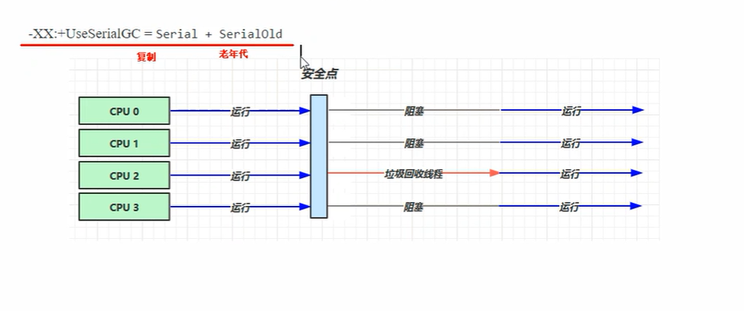

解释一下上图：上图的意思是说，当要运行垃圾回收的时候，对象的地址可能发生改变，所以需要所有用户线程到达一个安全点，然后对所有用户线程进行阻塞，让垃圾回收线程运行，也就是所谓的stop the world

#### 吞吐量优先垃圾回收器(JDK1.8默认垃圾回收器)

-XX:+UseParallelGC ~ -XX:+UseParallelOldGC

-XX:+UseAdaptiveSizePolicy   // 采用一个自适应的大小调整策略，主要是指调整新生代的大小，这个打开会动态的调整伊甸园和幸存区域的大小

-XX:GCTimeRatio=ratio // 

-XX:MaxGCPauseMillis=ms  //

-XX:ParallelGCThreads=n // 设置垃圾回收线程数

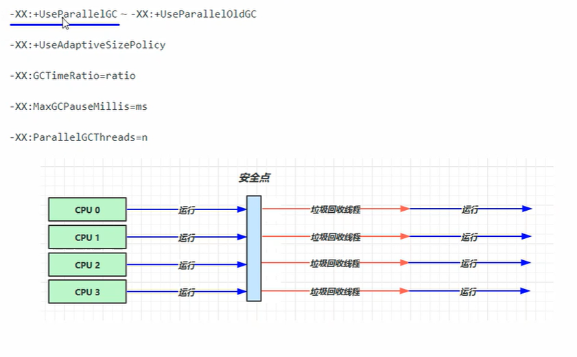

可以看到，与串行垃圾回收器相比，吞吐量优先垃圾回收器有多个垃圾回收线程共同执行垃圾回收任务，线程的数量默认是CPU数量，也可以通过-XX:ParallelGCThreads=n这个虚拟机参数来设置线程数量

#### 相应时间优先垃圾回收器

-XX:+UseConcMarkSweepGC ~ -XX:+UseParNewGC ~ SerialOld

-XX:ParallelGCThreads=n ~ -XX:ConcGCThreads=threads

-XX:CMSInitiatingOccupancyFraction=percent

-XX:+CMSScavengeBeforeRemark

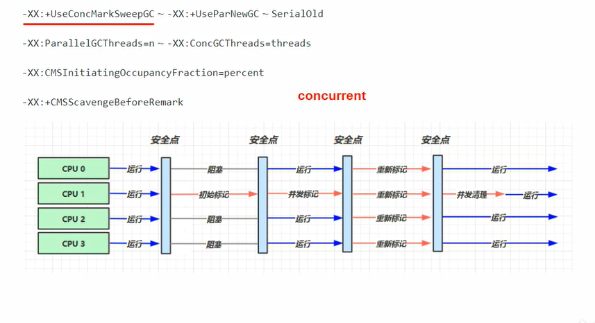

在所有用户线程到达第一个安全点之后，垃圾回收线程会首先进行一次初始标记，然后再次到达安全点，这个时候进行剩余的标记（并发进行，在此期间用户线程可以执行任务），并发标记完成之后，还会进行一次重新标记，重新标记完成之后到达最后一个安全点，垃圾回收线程开始执行清理（并发清理，在此期间，用户线程可以执行任务）

#### G1垃圾回收器

定义：Garbage First

* 2004论文发布
* 2009 JDK 6u14体验
* 2012 JDK 7u4 官方支持
* 2017 JDK 9 默认

适用场景

* 同时注重吞吐量（Throughput)和低延迟（Low latency)，默认的暂停目标是200ms
* 超大堆内存，会将堆划分为多个大小相等的Region
* 整体上是标记+整理算法，两个区域之间是复制算法

相关JVM参数

-XX:+UseG1GC

-XX:+G1HeapRegionSize=size

-XX:+MaxGCPauseMillis=time

##### G1垃圾回收阶段	

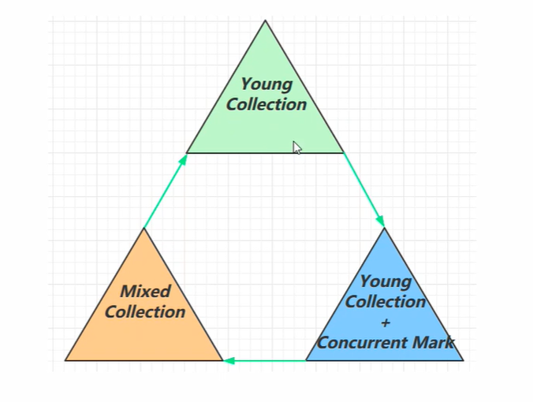

##### Young Collection（新生代内存布局）

* 会STW（stop the world）

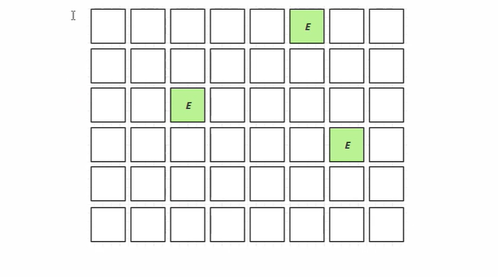

对于G1垃圾回收器，会将整个堆内存分为大小一样的内存区域，每个区域都可以独立作为伊甸园，幸存区，老年代，新生代垃圾回收都会触发一次STW（stop the world）

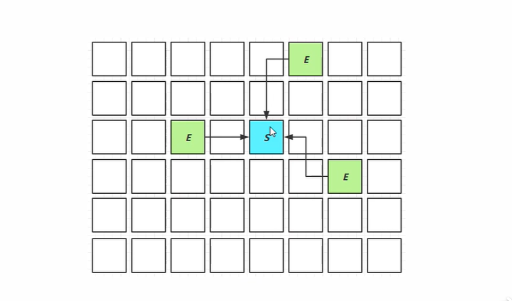

当执行垃圾回收的时候，会将需要保留的对象复制进入幸存区域

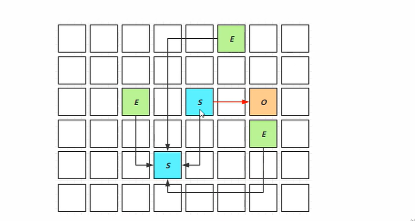

当幸存区的对象经历多次垃圾回收之后，随着年龄的增长，会进入老年代（红色箭头）

##### Young Collection + CM（新生代垃圾回收和并发标记）

* 在Young GC 时会进行GC Root 的初始标记

* 老年代占用堆空间比例达到阈值时，进行并发标记（不会STW），由下面JVM参数决定

  -XX:InitiatingHeapOccupancyPercent=percent (默认45%)

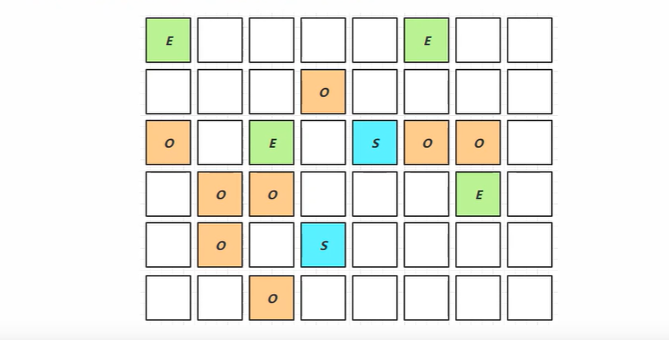

##### Mixed Collection

会对E、S、O进行全面垃圾回收

* 最终标记（Remark）会STW
* 拷贝存活（Evacuation）会STW

-XX:MaxGCPauseMillis=ms

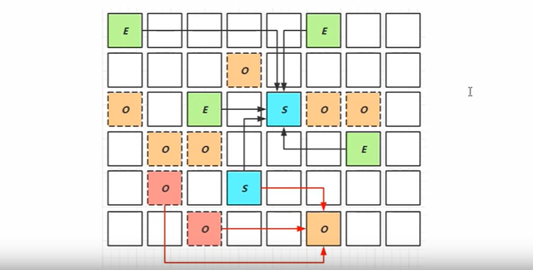


##### Full GC

* SerialGC
  * 新生代内存不足时发生的垃圾收集 -minor gc
  * 老年代内存不足发生的垃圾收集 -full gc
* ParallelGC
  * 新生代内存不足时发生的垃圾收集 -minor gc
  * 老年代内存不足发生的垃圾收集 -full gc
* CMS
  * 新生代内存不足时发生的垃圾收集 -minor gc
  * 老年代内存不足
* G1
  * 新生代内存不足时发生的垃圾收集 -minor gc
  * 老年代内存不足

##### Young Collection 夸代引用

* 新生代回收的跨代引用（老年代引用新生代）问题‘

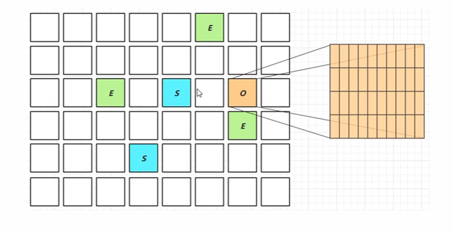

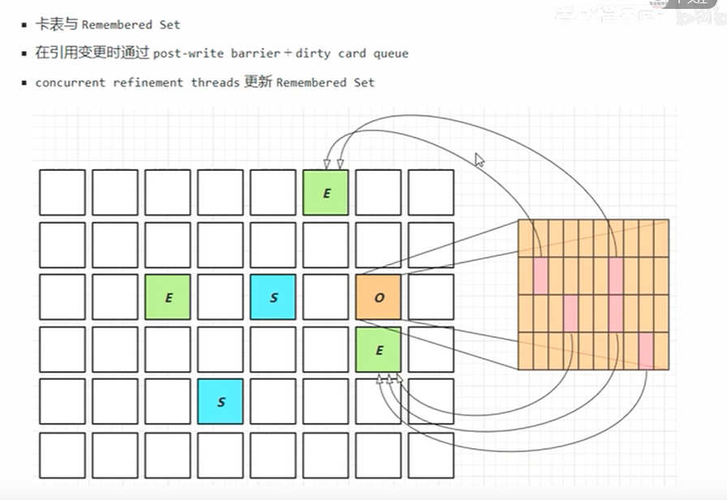


##### Remark（重标记）

* pre-write barrier + satb_mark_queue

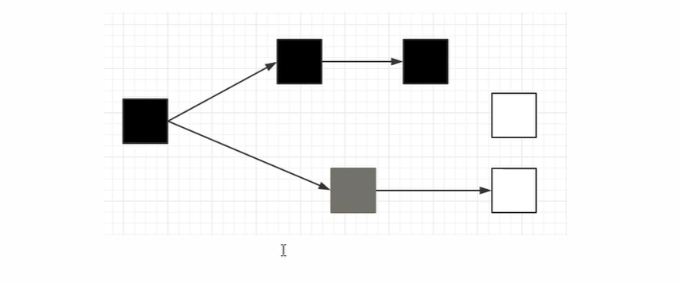


##### JDK 8u20 字符串去重

* 优点：节省大量内存
* 缺点：略微多占用了cpu时间，新生代回收时间略微增加

-XX:+UseStringDeduplication

```java
String s1 = new String("hello"); //char[] {'h', 'e', 'l', 'l', 'o'} 
String s2 = new String("hello"); //char[] {'h', 'e', 'l', 'l', 'o'} 
```

* 将所有新分配的字符串放入一个队列
* 当新生代回收时，G1并发检查是否有字符串重复
* 如果他们值一样，让它们引用同一个char[]
* 注意，与String.intern()不一样
  * String.intern() 关注的是字符串对象
  * 而字符串去重关注的是char[]
  * 在JVM内部，使用了不同的字符串表

##### JDK 8u40并发标记类卸载

所有对象都经过并发标记后，就能知道哪些类不再被使用，当一个类加载器的所有类都不再使用，则卸载所加载的所有类

-XX:+ClassUnloadingWithConcurrentMark 默认启用


##### JDK 8u60 回收巨型对象

* 一个对象大于region的一般时，称之为巨型对象
* G1不会对巨型对象进行拷贝
* 回收时被优先考虑
* G1会跟踪老年代所有incoming引用，这样老年代incoming引用为0的巨型对象就可以在新生代垃圾回收时处理掉

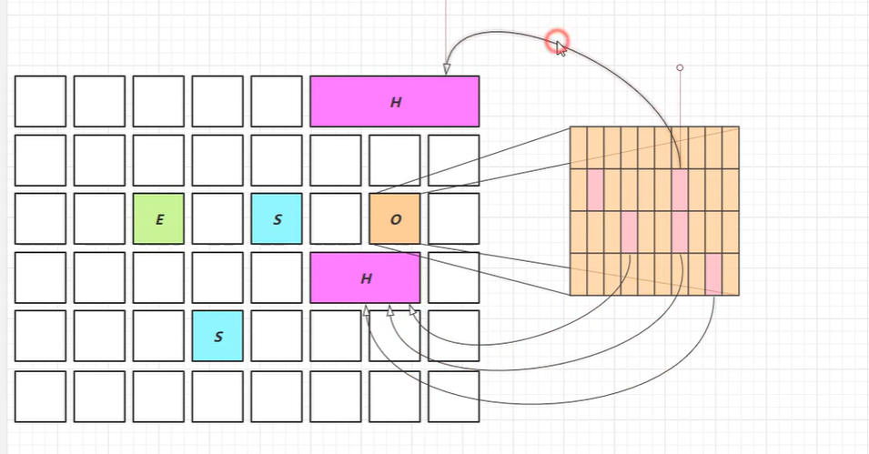


##### JDK9 并发标记起始时间的调整

* 并发标记必须在堆空间占满前完成，否则退化为FullGC
* JDK9之前需要使用 -XX:InitiatingHeapOccupancyPercent
* JDK9 可以动态调整
  * -XX:InitiatingHeapOccupancyPercent 用来设置初始值
  * 进行数据采样并动态调整
  * 总会添加一个安全的空档空间

JDK 9 更高效的回收

* 250+ 增加
* 180+bug修复
* [https://docs.oracle.com/en/java/javase/12/gctuning](https://docs.oracle.com/en/java/javase/12/gctuning)

