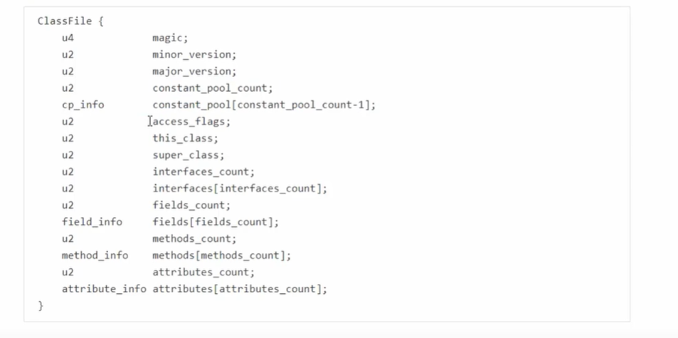
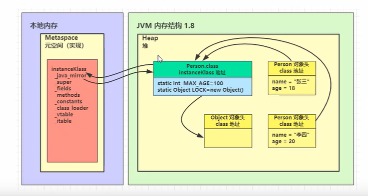
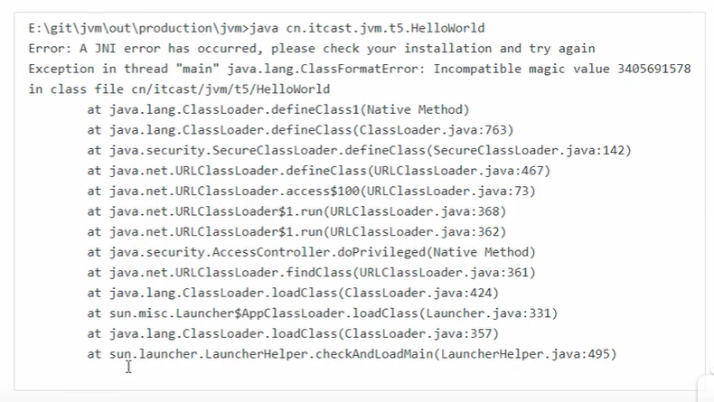

# 类加载

## 类文件结构

根据JVM规范，类文件结构如下

### 魔数

class文件用0-3字节，表示一个文件是否是【class】类型的文件

0000000 ca fe ba be 00 00 00 34 00 23 0a 00 06 00 15 09

其中ca fe ba be 表示class文件的魔数

### 版本

0000000 ca fe ba be 00 00 00 34 00 23 0a 00 06 00 15 09

其中 00 00 00 34 表示的是jdk8的版本（52）

### 常量池

8-9字节表示的是常量池的长度

## 类加载的阶段

### 加载

* 将类的字节码载入方法区中，内部采用C++的instanceKlass描述java类，它的重要field有
  * _java_mirror即java的类镜像，例如对String来说，就是String.class,作用是吧klass暴露给java使用
  * _super即父类
  * _fields即成员变量
  * _methods即方法
  * _constants即常量池
  * _class_loader即类加载器
  * _vtable虚方法表
  * _itable接口方法表
* 如果这个类还有父类没有加载，先加载父类
* 加载和链接可能是交替运行的

> 注意
>
> * instanceKlass这样的【元数据】是存储在方法区（1.8后的元空间内）
> * 可以通过HSDB工具查看

### 链接阶段

* 验证：验证类是否符合JVM规范，安全性检查

  用UE等支持二进制的编辑器修改Hello.class的魔数，在控制台运行

  

* 准备：为static变量分配空间，设置默认值
  * static变量在JDK7之前存储于instanceKlass末尾，从JDK7开始，存储于_java_mirror末尾
  * static变量分配空间和赋值是两个步骤,分配空间是准备阶段完成，赋值在初始化阶段完成
  * 如果static变量是final的基本类型，以及字符串常量，那么编译期阶段值就确定了，赋值在准备阶段完成
  * 如果static变量是final的，但属于引用类型，那么赋值也会在初始化阶段完成
* 解析：将常量池中的符号引用解析为直接引用

### 初始化

<cinit>()v方法

初始化即调用<cinit>()v，虚拟机会保证这个类的【构造方法】的线程安全

#### 发生的时机

概括的说，类的初始化是【懒惰的】

* main方法所在的类，总是会被首先初始化
* 首次访问这个类的静态变量或静态方法时
* 子类初始化，如果父类还没初始化，会引发
* 子类访问父类的静态变量，只会触发父类的初始化
* Class.forName
* new会导致初始化

不会导致类初始化的情况

* 访问类的static final静态常量（基本类型和字符串）不会触发初始化
* 类对象.class不会触发初始化
* 创建该类的数组不会触发初始化
* 类加载器的loadClass方法
* Class.forName的参数2为false时

