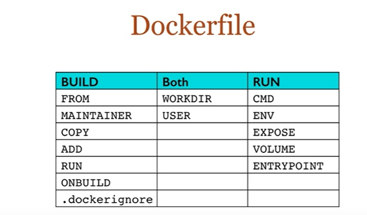

## DockerFile体系结构

### FROM

基础镜像，当前新镜像是基于哪个镜像的

### MAINTAINER

镜像维护者的姓名和邮箱地址

### RUN

容器构建时需要的命令

### EXPOSE

当前容器对外暴露出的端口

### WORKDIR

指定在创建容器后，终端默认登陆的进来工作目录，一个落脚点

### ENV

用来在构建镜像过程中设置环境变量

### ADD

将宿主机目录下的文件拷贝进镜像且ADD命令会自动处理URL和解压tar压缩包

### COPY

类似ADD，拷贝文件和目录到镜像中，将从构建上下文目录<源路径>的文件/目录复制到新的一层镜像内的<目标路径>位置

COPY src dst

COPY ["src", "dst"]

### VOLUME

容器数据卷，用于数据保存和持久化工作

### CMD

指定一个容器启动时要运行的命令，DockerFile中可以有多个CMD指令，但是只有最后一个生效，CMD会被docker run 之后的参数替换

### ENTRYPOINT

指定一个容器启动时要运行的命令，CMD和ENTRYPOINT的目的和CMD一样，都是指定容器启动程序及参数

### ONBUILD

当构建一个被继承的Dockerfile时运行命令，父镜像在被继承之后父镜像的onbuild会被触发，相当于是一个钩子程序

