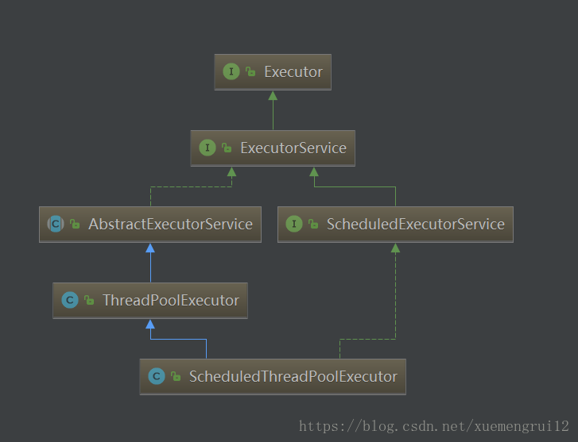
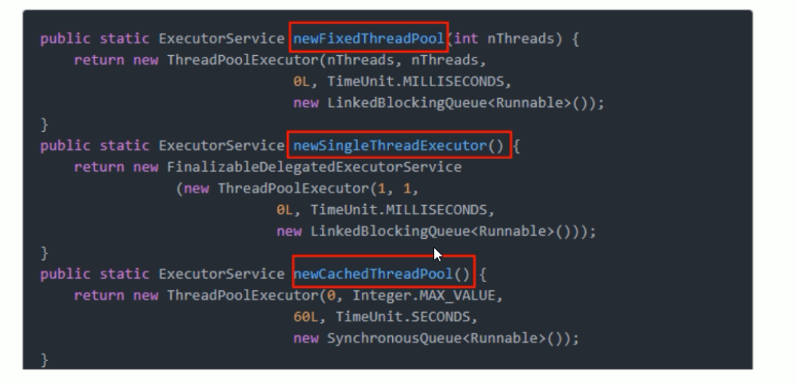
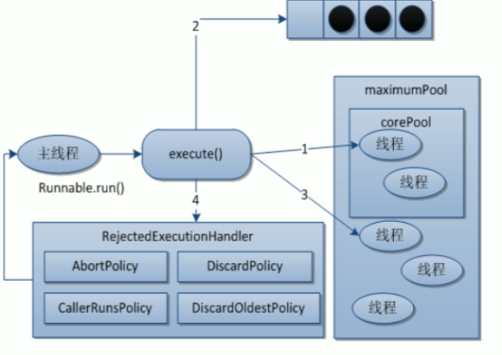

## JMM(java内存模型)


## CAS

CAS的全称为**Compare-And-Swap**, 它是一条CPU并发原语。

它的功能是判断内存某个位置的值是否为预期值，如果是则更改为新的值，这个过程是原子的。

CAS并发原语体现在JAVA语言中就是sun.misc.Unsafe类中的各个方法。调用UnSafe类中的CAS方法，JVM会帮我们实现出CAS汇编指令。这是一种完全依赖于硬件的功能，通过它实现了原子操作。**由于CAS是一种系统原语，原语属于操作系统用语范畴，是由若干条指令组成的，用于完成某个功能的一个过程，并且原语的执行必须是连续的，在执行过程中不允许被中断，也就是说CAS是一条CPU的原子指令，不会造成所谓的数据不一致问题。**


## 线程池

为什么用线程池？线程池的优势是什么？

线程池做得工作主要是控制运行的线程的数量，处理过程中将任务放入队列，然后在线程创建后启动这些任务，如果线程数量超过了最大数量超出数量的线程排队等候，等待其他线程执行完毕，再从队列中取出任务来执行。

他的主要特点为：线程复用；控制最大并发数；管理线程。


第一：降低资源消耗。通过重复利用已创建的线程降低线程创建和销毁造成的消耗。

第二：提高相应速度。当任务到达时，任务可以不需要的等到线程创建就能立即执行。

第三：提高线程的可管理性。线程是稀缺资源，如果无限制的创建，不仅会消耗系统资源，还会降低系统的稳定性，使用线程池可以进行统一的分配，调优和监控。


线程池的架构图




线程池种类

* Executors.newFixedThreadPool(int) 执行长期的任务 
* Executors.newSingleThreadExecutor() 一个任务一个任务执行
* Executors.newCachedThreadPool() 适用：执行很多任务
* Executors.newWorkStealingPool(int) java8新出
* Executors.newScheduledThreadPool() 

以上三种线程池底层都是ThreadPoolExecutor



线程池的7大参数：

```java
public ThreadPoolExecutor(int corePoolSize,
                              int maximumPoolSize,
                              long keepAliveTime,
                              TimeUnit unit,
                              BlockingQueue<Runnable> workQueue,
                              ThreadFactory threadFactory,
                              RejectedExecutionHandler handler) {
        if (corePoolSize < 0 ||
            maximumPoolSize <= 0 ||
            maximumPoolSize < corePoolSize ||
            keepAliveTime < 0)
            throw new IllegalArgumentException();
        if (workQueue == null || threadFactory == null || handler == null)
            throw new NullPointerException();
        this.corePoolSize = corePoolSize;
        this.maximumPoolSize = maximumPoolSize;
        this.workQueue = workQueue;
        this.keepAliveTime = unit.toNanos(keepAliveTime);
        this.threadFactory = threadFactory;
        this.handler = handler;
    }
```

* corePoolSize

  **线程池中的常驻核心线程数，当创建线程池之后，当有请求任务来之后，就会安排池中的线程去执行请求任务，近似理解为今日当值线程，当线程池中的线程数目达到corePoolSize后，就会把到达的任务放到缓存队列当中**

* maximumPoolSize

  线程池中能够容纳的同时执行的最大线程数，此值必须大于1

* keepAliveTime

  多余的空闲线程的存活时间。当前线程池中线程数量超过corePoolSize时，当空闲时间达到keepAliveTime值时，多余空闲线程会被销毁直到只剩下corePoolSize个线程为止。

* unit

  keepAliveTime的单位。

* workQueue

  任务队列，被提交但尚未被执行的任务。

* threadFactory

  表示生成线程池中工作线程的线程工厂，用于创建线程**一般用默认即可**

* handler

  拒绝策略，表示当队列满了并且工作线程大于等于线程池的最大线程数时如何拒接请求执行的runnable的策略

### 线程池的工作原理




线程池的工作原理：

1、在创建了线程池后，等待提交过来的任务请求。

2、当调用execute()方法添加一个请求任务时，线程池会做如下判断：

​	2.1、如果正在运行的线程数量小于corePoolSize，那么马上创建线程运行这个任务

​	2.2、如果正在运行的线程数量大于或等于corePoolSize，那么将这个任务放入队列

​	2.3、如果这时候队列满了且正在运行的线程数量还小于maximumPoolSize，那么还是要创建非核心线程立即运行这个任务

​	2.4、如果队列满了且正在运行的线程数量大于或等于maximumPoolSize，那么线程池会启动饱和拒绝策略来执行

3、当一个线程完成任务时，它会从队列中取下一个任务来执行

4、当一个线程无事可做超过一定的时间（keepAliveTime）时，线程池会判断：

​	如果当前运行的线程数大于corePoolSize，那么这个线程就会被停掉

​	所以线程池的所有任务完成后它最终会收缩到corePoolSize的大小


### 线程池的拒绝策略

* AbortPolicy(默认): 直接抛出RejectedExecutionException 异常阻止系统正常运行
* CallerRunsPolicy: "调用者运行" 一种调节机制，该策略既不会抛弃任务，也不会抛出异常，而是将某些任务回退到调用者，从而降低新任务的流量
* DiscardOldestPolicy: 抛弃队列中等待最久的任务，然后把当前任务加入队列中尝试再次提交当前任务
* DiscardPolicy: 直接丢弃任务，不予任何处理也不抛出异常。如果允许任务丢失，这是最好的方案


## 同步容器

解决并发情况下容器的线程安全问题，给多线程环境准备一个线程安全的容器对象。线程安全的容器对象：Vector；HashMap，这两个都是使用的synchronized方法实现的。concurrent包中的同步容器，大多数是使用系统底层技术实现的线程安全。类似native。Java8中使用CAS。

### Map/Set

* ConcurrentHashMap / ConcurrentHashSet

  底层哈希实现的同步Map/Set，效率高，线程安全。使用系统底层技术实现线程安全。量级较synchronized低。

* ConcurrentSkipListMap / ConcurrentSkipListSet

  底层跳表实现的同步Map(Set)，有序，效率比ConcurrentHashMap稍低。