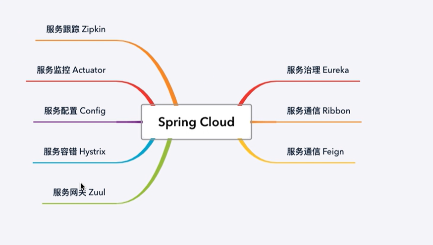

## 单体应用存在的问题

* 随着业务的发展，开发变得越来越复杂
* 修改、新增某个功能，需要对整个系统进行测试、重新部署
* 一个模块出现问题，很可能导致整个系统崩溃
* 多个开发团队同时对数据进行管理，容易产生安全漏洞
* 各个模块使用同一种技术进行开发，各个模块很难根据实际情况选择更加合适的技术框架，局限性很大
* 模块内容过于复杂，如果员工离职，可能需要很长时间才能完成交接工作

分布式、集群

集群：一台服务器无法负荷高并发的数据访问量，那么就设置十台服务器一起分担压力，十台不行就设置一百台（物理层面）。很多人干同一件事，来分摊压力。

分布式：将一个复杂问题拆分成	若干个简单的小问题，将一个大型的项目架构拆分成若干个微服务来协同完成（软件设计层面）。将一个庞大的工作拆分成若干个小步骤，分别由不同的人完成这些小步骤，最终将所有的结果进行整合实现大的需求。

## SpringCloud的架构

* 服务治理Eureka
* 服务通信Ribbon
* 服务通信Feign
* 服务网关Zuul
* 服务容错Hystrix
* 服务配置Config
* 服务监控Actuator
* 服务跟踪Zipkin

## 服务治理

服务治理由三个部分组成：服务提供者、服务消费者、注册中心。

在分布式系统中，每个微服务在启动时，将自己的信息存储在注册中心，这个过程叫做服务注册。

服务消费者从注册中心获取服务提供者的网络信息，通过该信息调用服务，叫做服务发现。

SpringCloud的服务治理使用的是Eureka来实现，Eureka是Netflix开源的基于REST的服务治理解决方案，SpringCloud集成了Eureka，提供服务注册和服务发现的功能，可以和基于SpringBoot搭建的微服务应用轻松的完成整合，开箱即用，SpringCloud Eureka

## SpringCloud Eureka

* Eureka Server

  注册中心

* Eureka Client

  所有要进行注册的微服务通过EurekaClient来连接到Eureka Server，完成注册

## 服务网关

SpringCloud集成了Zuul组件，实现服务网关

* 什么是Zuul?

Zuul是Netflix提供的一个开源的API网关服务器，是客户端和网站后端所有请求的中间层，对外开放一个API，将所有请求导入统一的入口，屏蔽了服务端的具体实现逻辑，Zuul可以实现反向代理的功能，在网关内部实现动态路由、身份认证、IP过滤、数据监控等。

## Ribbon负载均衡

* 什么是Ribbon?

  SpringCloud Ribbon 是一个负载均衡的解决方案，Ribbon是Netflix 发布的一款负载均衡器，Spring Cloud Ribbon是基于Netflix Ribbon 实现的，是一个用于对HTTP请求进行控制的负载均衡客户端。

  在注册中心对Ribbon进行注册之后，Ribbon就可以基于某种负载均衡算法，如轮询，随机，加权轮询，加权随机等等等自动帮助服务消费者调用接口，开发者也可以根据具体需求自定义Ribbon负载均衡算法，实际开发中，SpringCloud Ribbon 需要结合Spring Cloud Eureka来使用，Eureka Server提供所有可以调用的服务提供者列表，Ribbon基于特定的负载均衡算法从这些服务提供者中选择要调用的具体实例。

## Feign

* 什么是Feign

与Ribbon一样，Feign也是由Negflix提供的，Feign是一个声明式的、模板化的Web Service客户端，它简化了开发者编写Web服务客户端的操作，开发者可以通过简单的接口和注解来调用HTTP API，Spring Cloud Feign，它整合了Ribbon和Hystrix，具有可插拔、基于注解、负载均衡、服务熔断等一系列便捷功能。

相比较于 Ribbon + RestTemplate 的方式，Feign大大简化了代码的开发，Feign支持多种注解，包括Feign注解、JAX-RS注解、SpringMVC注解等，SpringCloud对Feign进行了优化，整合了Ribbon和Eureka，从而让Feign的使用更加方便。

* Ribbon 和 Feign的区别

Ribbon 是一个通用的HTTP客户端工具，Feign是基于Ribbon来实现的。

* Feign的特点

1、Feign是一个声明式的Web Service客户端

2、支持Feign注解、SpringMVC注解、JAX-RS注解

3、Feign基于Ribbon实现，使用起来更加简单

4、Feign集成了Hystrix，具备服务熔断的功能

## Hystrix容错机制

在不改变各个微服务调用关系的前提下，针对错误情况进行预先处理

* 设计原则

1、服务隔离机制

2、服务降级机制

3、熔断机制

4、提供实时的监控和报警功能

5、提供实时的配置修改功能

Hystrix 数据监控需要结合 Spring Boot Actuator 来使用，这个组件提供了对服务的健康监控、数据统计，可以通过hystrix-stream节点获取监控的请求数据，提供了可视化的监控界面。

## SpringCloud 配置中心

Spring Cloud Config，通过服务端可以为多个客户端提供配置服务。SpringCloud Config 可以将配置文件存储在本地，也可以将配置文件存储在远程Git仓库，创建Config Server，通过它管理所有的配置文件。

## 本地文件系统

